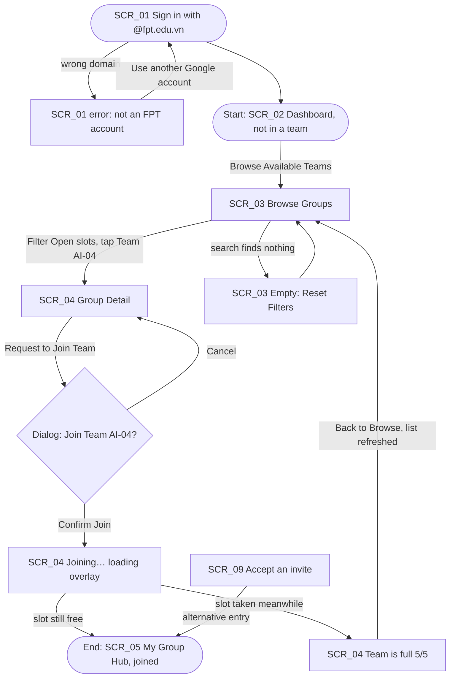
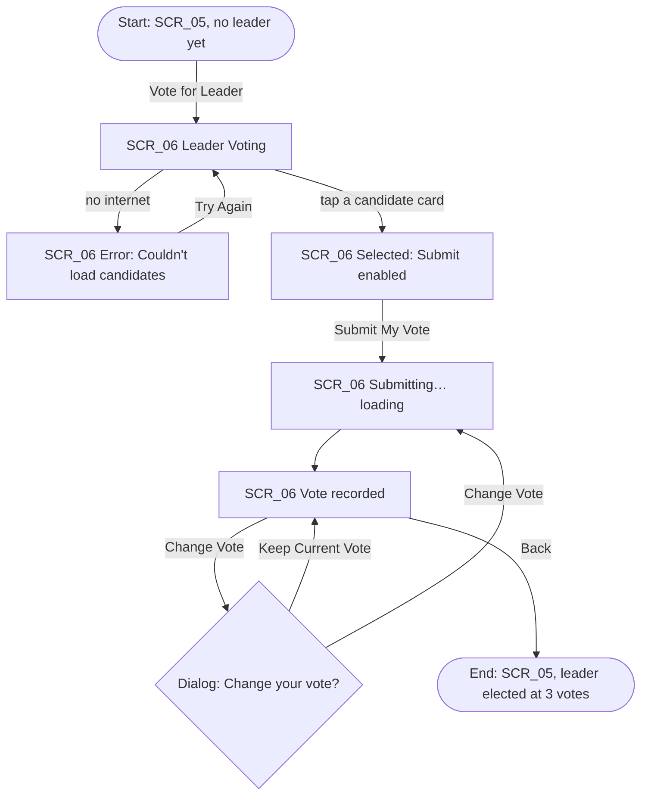
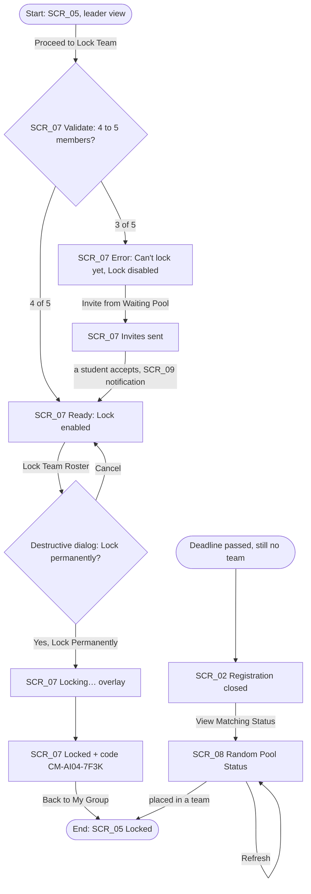

# Information Architecture & User Flows

## 1. Information Architecture

### Screen inventory

| ID | Screen | Level | Reached from | Used by flow |
|---|---|---|---|---|
| `SCR_01` | Sign In (FPT Google SSO) | Entry | App launch | Flow 1 |
| `SCR_02` | Dashboard / Home | Top-level tab 1 | Sign-in, bottom nav | Flow 1 (start), Flow 3 (after deadline) |
| `SCR_03` | Browse Groups | Top-level tab 2 | Dashboard CTA, bottom nav | Flow 1 |
| `SCR_04` | Group Detail | Nested under SCR_03 | Tap a group card | Flow 1 |
| `SCR_05` | My Group Hub | Top-level tab 3 | Bottom nav, after joining | Flow 1 (end), Flow 2 (start/end), Flow 3 (start/end) |
| `SCR_06` | Leader Voting | Nested under SCR_05 | "Vote for Leader" | Flow 2 |
| `SCR_07` | Lock Review & Error Recovery | Nested under SCR_05 | "Proceed to Lock Team" (leader only) | Flow 3 |
| `SCR_08` | Random Pool Status | Nested under SCR_02 | Dashboard after the deadline | Flow 3 (after-deadline path) |
| `SCR_09` | Notifications & Invites | Top-level tab 4 | Bottom nav, app-bar bell | Flow 1 (invite entry), Flow 3 (recovery) |

Every screen is used by at least one flow.

### Navigation structure

```
[SCR_01 Sign In]
       │
       ▼
┌───────────────────────── Bottom navigation (4 tabs) ─────────────────────────┐
│  SCR_02 Home        SCR_03 Browse        SCR_05 My Group        SCR_09 Alerts │
└──────┬─────────────────────┬────────────────────┬──────────────────────┬─────┘
       │                     │                    ├─► SCR_06 Leader Voting
       ▼                     ▼                    └─► SCR_07 Lock Review & Recovery
 SCR_08 Random Pool    SCR_04 Group Detail
 (after the deadline)
```

- Top-level tabs keep the bottom navigation; nested screens replace it with a Back arrow in the app bar.
- System Back on a nested screen returns to its parent tab. Back on a top-level tab goes to Home. Back on Home asks before leaving the app.
- Only the elected leader sees "Proceed to Lock Team" on SCR_05, so SCR_07 is reachable only from the leader's phone.

---

## 2. User Flows

The same flows are drawn on Figma page **01 User Flow** (each step links to its screen). They are clickable on page **06 Prototype**, which has one starting point per flow.

### Flow 1: Discover and join an open Capstone team
- **Start:** `SCR_02` Dashboard, student not in a team
- **Goal:** join a compatible team that still has an open slot
- **End:** `SCR_05` My Group Hub showing "You joined Team AI-04"



### Flow 2: Vote for a team leader
- **Start:** `SCR_05` My Group Hub, "No leader yet" banner
- **Goal:** elect the member who is allowed to lock the roster
- **End:** `SCR_05` with a Leader badge (Tran Thu Ha, 3 of 4 votes)



### Flow 3: Lock the team roster (with error and recovery path)
- **Start:** `SCR_05` My Group Hub on the leader's phone
- **Goal:** submit a valid 4–5 member roster to the Academic Office
- **End:** `SCR_05` showing Locked and a confirmation code



---

## 3. Flow-to-Screen Mapping

| Flow | Start | Screens used | End | Alternative / error path |
|---|---|---|---|---|
| **1 · Join a team** | `SCR_02` | SCR_01, 02, 03, 04, 05, 09 | `SCR_05` | Wrong sign-in domain → retry. Empty search → Reset Filters. Team filled before confirming → "Team is full", back to a refreshed SCR_03. Join from an invite in SCR_09. |
| **2 · Vote leader** | `SCR_05` | SCR_05, 06 | `SCR_05` | Change Vote dialog. Load error → Try Again (vote not sent). |
| **3 · Lock roster** | `SCR_05` | SCR_05, 07, 09, 02, 08 | `SCR_05` | **Error:** fewer than 4 members, so Lock is disabled with the reason. **Recovery:** Invite from Waiting Pool; lock is enabled when someone accepts. After the deadline: SCR_02 → SCR_08 matching status. |
