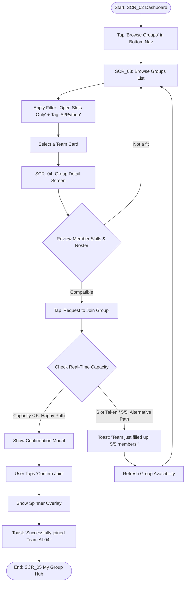
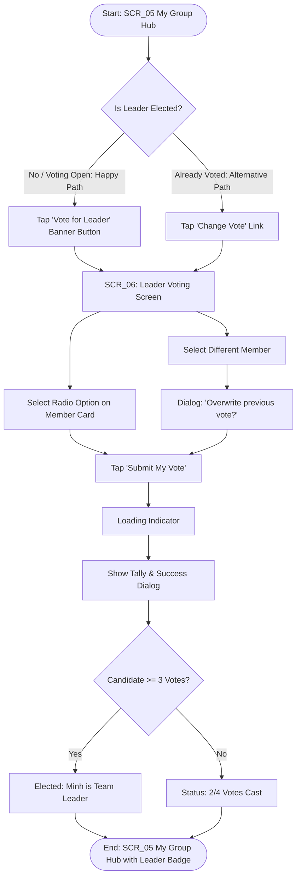
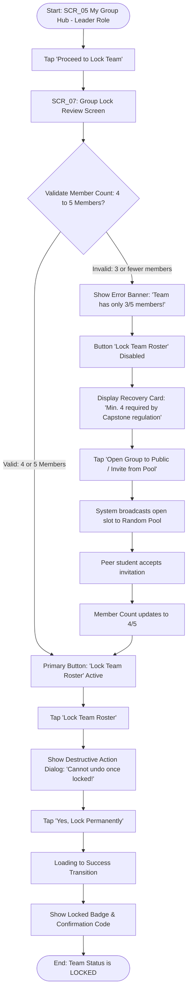

# Information Architecture & User Flows

## 1. Information Architecture (Screen Inventory & Hierarchy)

### Hierarchy Overview
- **Top-Level Screens (Persistent Bottom Navigation):**
  - `SCR_02` Dashboard / Home
  - `SCR_03` Browse Groups
  - `SCR_05` My Group Hub
  - `SCR_09` Notifications
- **Auth / Onboarding:**
  - `SCR_01` Sign In (FPT SSO)
- **Nested / Modal Screens:**
  - `SCR_04` Group Detail (Nested under `SCR_03` Browse Groups)
  - `SCR_06` Leader Voting (Nested under `SCR_05` My Group Hub)
  - `SCR_07` Group Lock Review & Error Recovery (Nested under `SCR_05` My Group Hub)
  - `SCR_08` Random Pool Status (Accessed from `SCR_02` Dashboard if unassigned post-deadline)

```
[SCR_01: Sign In]
       │
       ▼
┌────────────────────────────────────────────────────────┐
│               Main App (Bottom Navigation)             │
├──────────────┬──────────────┬──────────────┬───────────┤
│    SCR_02    │    SCR_03    │    SCR_05    │   SCR_09  │
│  Dashboard   │ Browse Groups│ My Group Hub │  Notifs   │
└──────┬───────┴──────┬───────┴──────┬───────┴───────────┘
       │              │              │
       ▼              ▼              ├─► [SCR_06: Leader Voting]
 [SCR_08: Random] [SCR_04: Detail]   └─► [SCR_07: Lock Review & Recovery]
```

---

## 2. User Flows (Mermaid Diagrams)

### Flow 1: Discover & Join an Open Capstone Group
- **Start:** `SCR_02` (Dashboard)
- **Goal:** Student successfully finds and joins a compatible team with open slots (4–5 quota).
- **End:** Group roster updated in `SCR_05` (My Group Hub) or redirected back to browse.



---

### Flow 2: Team Leader Voting
- **Start:** `SCR_05` (My Group Hub)
- **Goal:** Democratic election of a Team Leader so that administrative actions (Locking) can be enabled.
- **End:** Leader designated with badge in `SCR_05`.



---

### Flow 3: Group Roster Lock (With Error & Recovery Path)
- **Start:** `SCR_05` (My Group Hub, as elected Leader)
- **Goal:** Lock the team roster to officially submit team composition to university academic registrar.
- **End:** Group status is permanently LOCKED, or team unlocked with public recruiting enabled.



---

## 3. Flow-to-Screen Mapping Table

| Flow Name | Start Screen | Intermediary Screens | End Screen | Error / Alternative Paths |
|---|---|---|---|---|
| **Flow 1: Join Group** | `SCR_02` Dashboard | `SCR_03` Browse Groups, `SCR_04` Group Detail | `SCR_05` My Group Hub | Alternative: Group reaches 5/5 slots before confirmation; toasts error and returns to `SCR_03`. |
| **Flow 2: Vote Leader** | `SCR_05` My Group Hub | `SCR_06` Leader Voting | `SCR_05` My Group Hub | Alternative: Member wants to revise vote prior to voting cutoff; uses "Change Vote" dialog. |
| **Flow 3: Lock Group** | `SCR_05` My Group Hub | `SCR_07` Lock Review | `SCR_05` My Group Hub | **Error Path:** Team has < 4 members. "Lock" is disabled with error explanation; **Recovery:** Action button triggers public recruitment to fill the 4th slot. |
